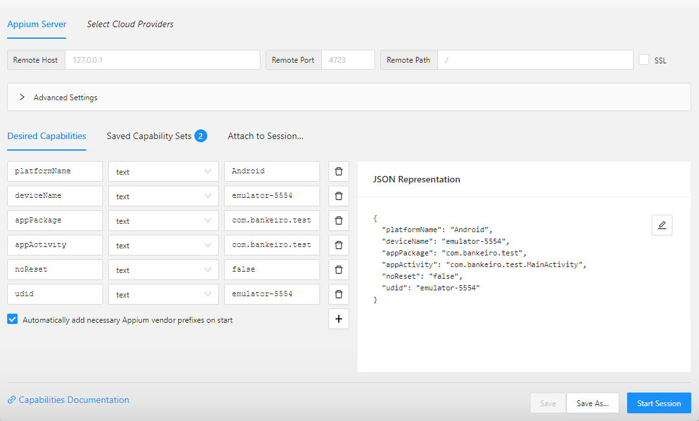

# Projeto de automação Robot e Appium
Projeto criado para rodar testes automatizados de aceitação (e2e) no front-end, utilizando as tecnologias do Robot Framework e do Appium. Os testes devem ser capazes de serem rodados localmente e na pipeline

# Robot e Appium Template
> Repositório de testes dedicados ao uso das mais variadas bibliotecas do robot framework com appium

# Configuração do Ambiente

## Instalar Python 3.10

Certifique-se de ter o Python 3.10 instalado em seu sistema. Você pode baixá-lo no [site oficial do Python](https://www.python.org/).

## Instalar Ambiente Virtual

Instale a ferramenta `virtualenv` para criar ambientes virtuais de aprendizado:

> pip install virtualenv

## Criar um ambiente virtual:
> python -m venv project-venv

## Se você estiver usando o PowerShell e encontrar problemas para executar scripts, talvez precise alterar a política de execução temporariamente para permitir a execução de scripts:
> Set-ExecutionPolicy -Scope Process -ExecutionPolicy Bypass

## Ativar o ambiente virtual:
> .\project-venv\Scripts\activate

## Remover cache do pip
> pip cache remove *

## Desativar ambiente virtual
> deactivate

## Instalar dependências do Python
Primeiro ative o ambiente virtual para evitar erros de versão com outras bibliotecas instaladas
> pip install -r requirements.txt

## Instalar nvm:
Necessário para poder mudar a versão do Node para a usada no projeto
> https://github.com/nvm-sh/nvm/blob/master/README.md

## Instalar Node.js:
Ao instalar, provavelmente vários pacotes adicionais serão instalados, como chocolatery, etc.
> https://nodejs.org/en/download

## Modificar versão padrão do node para a usada no projeto:
> nvm use

## Para instalar o Appium
> npm i -g appium

## Para verificar as dependências do appium para automação mobile
> npm i -g appium-doctor

## Instalar driver uiautomator2 para testes Android
> appium driver install uiautomator2

## Para verificar os drivers instalados do Appium
> appium driver list

## Para inspecionar os elementos do app
Baixe o Appium Inspector, no projeto foi usado a versão 2023.8.4
> https://github.com/appium/appium-inspector/releases

## Configure o Appium Inspector
As configurações para inspecionar no Android, devem ficar parecidas com essas:

## Lint do código
> robotidy src

 

### ---- Diferenciais no projeto ----
 

- Page Object
- Robot Framework
- Appium
- Massa de Dados
- Geração de Report

 

### ---- Pré-Requisitos Testes Mobile (APP) ----
- Instalação e Configuração: https://www.youtube.com/watch?v=W5hcHbzTjOc
- Java jdk8, Android Studio, Java SDK, Variáveis de ambiente do sistema, webdriver.io (dependência)
- importante: atualizar a variável de ambiente de %ANDROID_HOME%/build-tools para %ANDROID_HOME%\platform-tools
- iniciar o device pelo AVD Manager do Android Studio ou ter um celular concectado via cabo usb e permitir a depuração ubs.
- comandos para iniciar a ligação com o appium: appium, adb kill-server, adb start-server, adb-devices
- videos adicionais de ajuda: https://www.youtube.com/watch?v=QYT0_qgkiCw / https://www.youtube.com/watch?v=0a5NAJjUBbA

### ---- Comandos para rodar testes no APP: ----

 

*Observação: Para executar os testes com appium é preciso antes <u>inicializar o device pelo AVD Manager</u> no Android Studio.*

 

**Iniciar o appium**
> npm run appium

**Verificar dispositivos disponíveis no ADB**
> adb devices

**Para verificar os emuladores instalados**
> emulator -list-avds

**Executar teste regressivo**
> npm run test

### EXTRAS
- https://eliasnogueira.github.io/appium-workshop/
- https://serhatbolsu.github.io/robotframework-appiumlibrary/AppiumLibrary.html#Open%20Application
